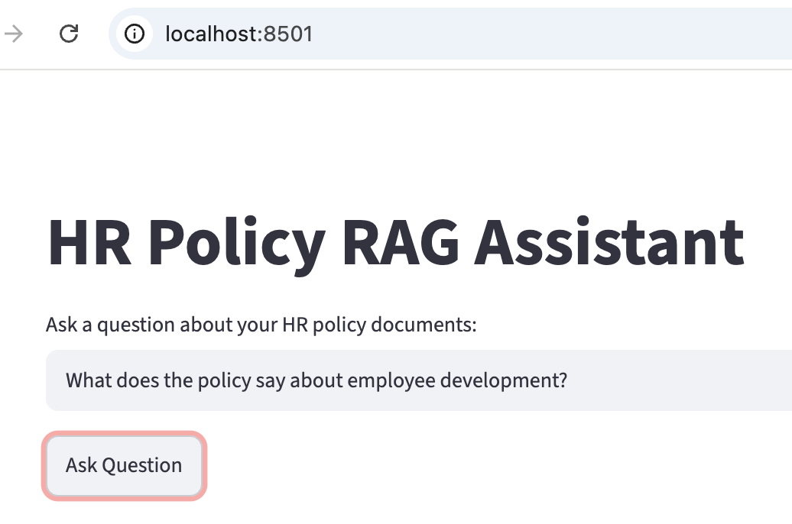
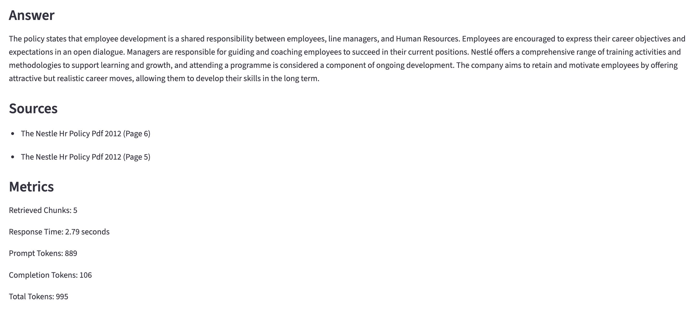

# HR Policy RAG Assistant

A production-style Retrieval-Augmented Generation (RAG) application that enables natural language querying of HR policy documents using OpenAI embeddings, FAISS vector search, and GPT-4o. Built with Python, OpenAI, LangChain, FAISS, and Streamlit.

## Overview

HR Policy RAG Assistant is a Retrieval-Augmented Generation (RAG) application designed to answer questions about organizational policy documents.

The application ingests PDF-based HR documentation, converts content into vector embeddings, stores them in a FAISS vector database, and retrieves relevant context to generate grounded responses using GPT-4o.

The project was originally developed as a notebook-based prototype and later refactored into a production-style architecture emphasizing maintainability, observability, testing, and modular design.

## Features

- Multi-document PDF ingestion
- OpenAI embedding generation
- FAISS vector database
- Semantic search and retrieval
- GPT-4o powered responses
- Source citations with page references
- Streamlit user interface
- Response observability metrics
- Configurable application settings
- Automated tests using pytest

## Quick Start

```bash
pip install -r requirements.txt

python ingest.py

streamlit run app/ui/streamlit_app.py
```

## Tech Stack

- Python
- OpenAI API
- GPT-4o
- OpenAI Embeddings
- LangChain
- FAISS
- Streamlit
- PyPDF
- Pytest

## Application Preview




## Architecture

```text
PDF Documents
      │
      ▼
Document Loader
      │
      ▼
Text Chunking
      │
      ▼
OpenAI Embeddings
      │
      ▼
FAISS Vector Store
      │
      ▼
Retriever
      │
      ▼
Prompt Template
      │
      ▼
GPT-4o
      │
      ▼
Answer + Citations + Metrics
```

## Project Structure

```text
rag-ai_powered_hr_assistant/
├── app/
│   ├── chains/
│   │   └── rag_chain.py              # RAG pipeline orchestration
│   ├── config/
│   │   └── settings.py               # Centralized app configuration
│   ├── ingestion/
│   │   ├── chunking.py               # Document chunking logic
│   │   └── loader.py                 # PDF/document loading utilities
│   ├── prompts/
│   │   └── hr_prompt.py              # HR assistant prompt template
│   ├── retrieval/
│   │   ├── embeddings.py             # Embedding model setup
│   │   ├── retriever.py              # Retriever configuration
│   │   └── vector_store.py           # Vector store creation/loading
│   ├── ui/
│   │   └── streamlit_app.py          # Streamlit user interface
│   └── utils/                        # Shared helper utilities
├── data/
│   └── nestle_hr_policy.pdf          # Source HR policy document
├── notebooks/
│   └── AI_Powered_HR_Assistant_RAMOS_2_12_26.ipynb
│                                      # Original notebook prototype
├── tests/
│   ├── test_chunking.py              # Chunking tests
│   ├── test_loader.py                # Loader tests
│   ├── test_prompt.py                # Prompt tests
│   └── test_retriever.py             # Retriever tests
├── vector_store/
│   ├── index.faiss                   # FAISS vector index - Generated during ingestion and excluded from source control.
│   └── index.pkl                     # Vector store metadata - Generated during ingestion and excluded from source control.
├── .env.example                      # Example environment variables
├── .gitignore                        # Files excluded from version control
├── ingest.py                         # Script to ingest documents/build index
├── main.py                           # Main application entry point
├── pytest.ini                        # Pytest configuration
├── requirements.txt                  # Python dependencies
└── README.md                         # Project documentation
```

## Installation

Clone the repository:

```bash
git clone https://github.com/rico-ramos/rag-ai_powered_hr_assistant.git
cd rag-ai_powered_hr_assistant
```

Create a virtual environment:

```bash
python3.12 -m venv .venv
source .venv/bin/activate
```

Install dependencies:

```bash
pip install -r requirements.txt
```

## Configuration

Create a `.env` file:

```env
OPENAI_API_KEY=your_api_key_here
```

## Usage

### Step 1: Add PDF Documents

Place PDF documents in:

```text
data/
```

### Step 2: Build Vector Store

python ingest.py

### Step 3: Launch Application

```bash
PYTHONPATH=. streamlit run app/ui/streamlit_app.py
```

## Example Questions

- What does the policy say about employee development?
- How are training priorities determined?
- What responsibilities do managers have regarding employee learning?
- What opportunities exist for professional growth?

## Metrics

The application surfaces retrieval and response metrics including:

- Retrieved chunk count
- Response latency
- Prompt token usage
- Completion token usage
- Total token usage

These metrics help evaluate retrieval quality, application performance, and model usage costs while providing visibility into overall RAG system behavior.

## Key Outcomes

- Refactored a notebook-based RAG prototype into a modular, production-style application
- Implemented semantic retrieval using OpenAI embeddings and FAISS vector search
- Reduced repeated embedding costs through persistent vector store storage
- Added source citation tracking to improve answer transparency and trustworthiness
- Implemented observability metrics including latency and token usage monitoring
- Added automated tests covering document ingestion, chunking, retrieval, and prompt generation

## Testing

Run all tests:

```bash
pytest -v
```

Current test coverage includes:

- Document loading
- Chunk generation
- Vector retrieval
- Prompt formatting

## Key Engineering Decisions

### Why FAISS?

FAISS was selected as the vector database because it provides fast similarity search, integrates well with LangChain, and is lightweight enough for local development and portfolio projects. It allows semantic retrieval without requiring external infrastructure.

### Why Persist the Vector Store?

Embedding generation is one of the most expensive operations in a RAG pipeline. By separating ingestion from querying and persisting the vector store to disk, documents only need to be processed once. This significantly reduces startup time and API costs.

### Why Separate Ingestion from Querying?

The project separates document ingestion (`ingest.py`) from the user-facing application (`streamlit_app.py`) to mirror common production architectures. This allows documents to be indexed independently while keeping the application responsive during normal use.

### Why Use Source Citations?

RAG systems should provide transparency into where information originates. Source citations allow users to verify answers against the original documents and improve trust in generated responses.

### Why Surface Metrics?

The application exposes retrieval count, response latency, and token usage metrics to provide visibility into system behavior. These metrics help evaluate retrieval effectiveness, monitor performance, and estimate model usage costs.

### Why Modularize the Application?

The original implementation existed as a notebook prototype. Refactoring into dedicated ingestion, retrieval, prompting, UI, and testing modules improved maintainability, testability, and overall project organization while preserving the original functionality.

## Project Evolution

This project began as a notebook-based prototype designed to explore Retrieval-Augmented Generation (RAG) concepts using a single HR policy document.

The application was later refactored into a production-style architecture with:

- Modular ingestion and retrieval components
- Persistent vector storage
- Configurable settings
- Streamlit-based user interface
- Source citation tracking
- Response observability metrics
- Automated testing

The goal of the refactor was to demonstrate how an experimental AI workflow can be evolved into a maintainable software application while preserving the core RAG functionality.

## Future Improvements

- Hybrid semantic and keyword-based search
- Metadata-aware document filtering
- Retrieval reranking for improved answer relevance
- Query expansion and reformulation
- Multi-document collections with category filtering
- Conversation memory
- Docker deployment
- CI/CD automation
- Cloud deployment
